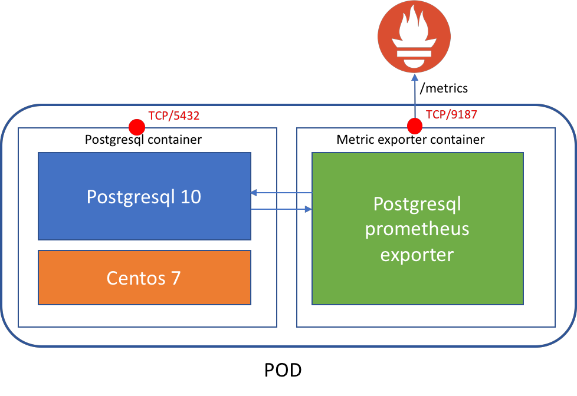

PostgreSQL 10 + Prometheus exporter container images
=====================================================

Target architecture
-------------------

Environment variables and volumes
---------------------------------

The image recognizes the following environment variables :

**`POSTGRESQL_USER`**  
       User name for PostgreSQL account to be created

**`POSTGRESQL_PASSWORD`**  
       Password for the user account

**`POSTGRESQL_DATABASE`**  
       Database name

**`POSTGRESQL_ADMIN_PASSWORD`**  
       Password for the `postgres` admin account (optional)

Alternatively, the following options are related to migration scenario:

**`POSTGRESQL_MIGRATION_REMOTE_HOST`**  
       Hostname/IP to migrate from

**`POSTGRESQL_MIGRATION_ADMIN_PASSWORD`**  
       Password for the remote 'postgres' admin user

**`POSTGRESQL_MIGRATION_IGNORE_ERRORS (optional, default 'no')`**  
       Set to 'yes' to ignore sql import errors

The following environment variables influence the PostgreSQL configuration file. They are all optional.

**`POSTGRESQL_MAX_CONNECTIONS (default: 100)`**  
       The maximum number of client connections allowed

**`POSTGRESQL_MAX_PREPARED_TRANSACTIONS (default: 0)`**  
       Sets the maximum number of transactions that can be in the "prepared" state. If you are using prepared transactions, you will probably want this to be at least as large as max_connections

**`POSTGRESQL_SHARED_BUFFERS (default: 32M)`**  
       Sets how much memory is dedicated to PostgreSQL to use for caching data

**`POSTGRESQL_EFFECTIVE_CACHE_SIZE (default: 128M)`**  
       Set to an estimate of how much memory is available for disk caching by the operating system and within the database itself

**`LOGGING_COLLECTOR (default: off)`**

**`CLIENT_MIN_MESSAGES (default: NOTICE)`**

**`LOG_MIN_MESSAGE (default: INFO)`**

**`LOG_STATEMENT (default: none)`**

**`LOG_MIN_DURATION_STATEMENT (default: 250)`**

CREDITS
-------

RedHat Openshift Postgresql container : https://github.com/sclorg/postgresql-container